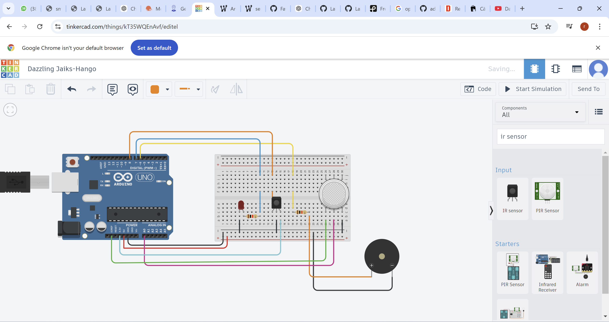

# Sistem de Detectare a Flăcării 🔥

## Descriere

Acest proiect reprezintă un sistem inteligent de detectare a flăcării realizat folosind Arduino Uno și senzori specifici pentru identificarea rapidă a surselor de foc. Sistemul are rolul de a crește siguranța prin detectarea flăcărilor și activarea unor semnale de avertizare.

Proiectul combină componente hardware și software pentru monitorizarea mediului și reacția automată la apariția unei flăcări.

## Funcționalități

🔥 Detectarea flăcării folosind senzori dedicați

🚨 Activarea unui semnal de avertizare

💡 Aprinderea LED-urilor pentru semnalizare

⚡ Monitorizare în timp real

🖥️ Afișarea informațiilor prin intermediul Arduino

🔌 Integrarea componentelor electronice pe plăcuță Arduino Uno

## Componente utilizate

- Arduino Uno

- Senzor de flacără

- LED-uri

- Breadboard

- Rezistențe

- Fire de conexiune

- Cablu USB pentru alimentare și programare

## Tehnologii și programe folosite

- Arduino IDE

- Limbaj C/C++

- Electronică digitală

- Arduino Uno

## Cum funcționează

Senzorul de flacără monitorizează permanent mediul înconjurător. În momentul în care detectează o sursă de foc, sistemul transmite informația către placa Arduino Uno, care activează automat LED-urile și semnalele de avertizare.

## Ce am învățat

- Prin realizarea acestui proiect am învățat:

- Programarea unei plăci Arduino Uno

- Utilizarea senzorilor electronici

- Realizarea conexiunilor hardware

- Monitorizarea și procesarea datelor în timp real

- Integrarea componentelor hardware cu software-ul

## COD UTILIZAT:

#define MQ2pin 1

int ledPin=7;

const int buzzer=6;

float sensorValue;

void setup ()

{

  pinMode (13, OUTPUT); 

  pinMode (8, INPUT);   

  Serial.begin(9600);

  pinMode(ledPin, OUTPUT);

  pinMode(buzzer, OUTPUT);

  	Serial.begin(9600); 

	Serial.println("MQ2 warming up!");

	delay(20000);  

}

void loop ()

{

  sensorValue = analogRead(MQ2pin);

  Serial.print("Sensor Value: ");

	Serial.println(sensorValue);

  delay(2000);

  Serial.print("Analog pin: "); 

  Serial.print(analogRead(A0));

  Serial.print(" | Digital pin: ");

  if (digitalRead(8) == HIGH && sensorValue > 51) {

    Serial.println("High");

    digitalWrite (ledPin, LOW);

    delay(500);

    digitalWrite (ledPin, HIGH);

    tone(buzzer, 1000);

    delay(1000);

    noTone(buzzer);

    delay(1000); 

  }

  else {

    Serial.println("Low");

    digitalWrite (ledPin, LOW);

  }

  delay(100); 

}

## 📸 Imagini din proiect

### Imagine 1

### Imagine 2

### Imagine 3

### Imagine 4

